### 坚持 (｡◕ˇ∀ˇ◕) ,HTTP WebSocket 

# HTTP
超文本传输协议（超文本转移协议）

### TCP/IP
互联网相关的各类协议族的总称，协议存在各式各样的内容。从电缆的规格到IP地址的选定方法、双方建立通信的顺序，以及web页面显示需要处理的步骤，等等。  
按层次分别为：应用层、传输层、网络层、数据链路层。  

#### 从客户端发送请求到服务端接收请求流程如图： 
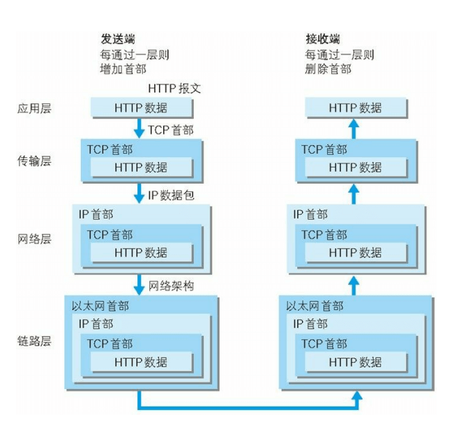 
<!--more-->

### IP
IP协议的作用是把各种数据包传送给对方。而要确保传送到对方那里，则需要满足各类条件。其中最重要的条件是IP地址和MAC地址（网卡所属的固定地址）
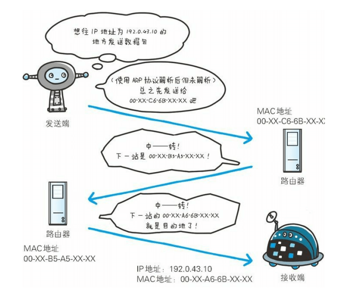  

### TCP  
TCP位于传输层，提供可靠的字节流服务。为了更容易传达大数据把数据分割，确保数据能到达目标。  
为了准确无误的将数据送达到目标出，采用三次握手策略。
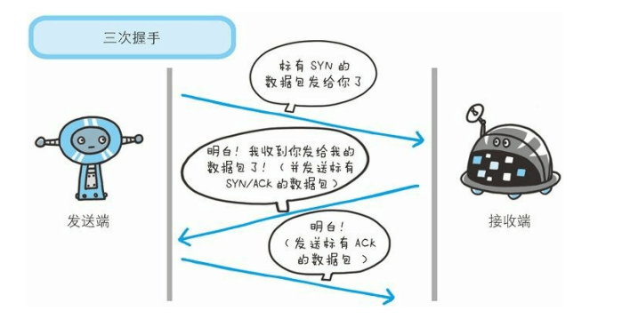  

### DNS  
DNS位于应用层的协议。提供域名到IP地址之间的解析服务。  
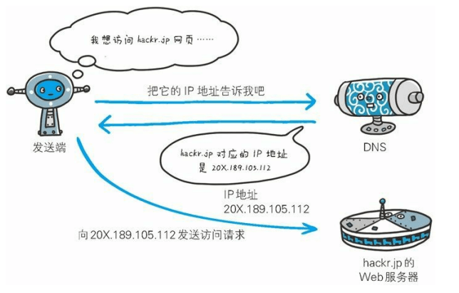  

### 总结  
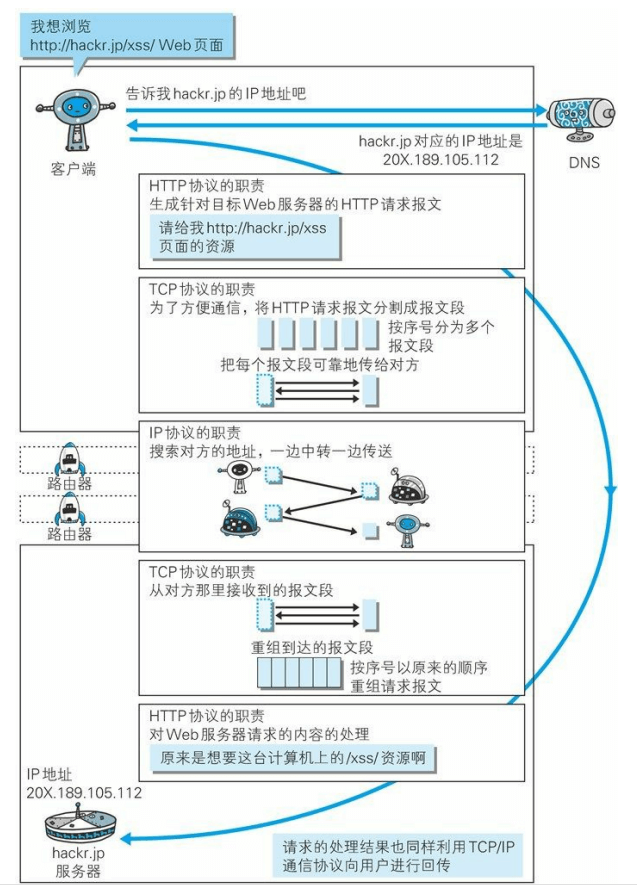  

### 告知服务器意图的HTTP方法  
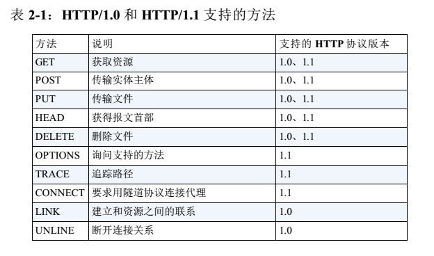  

### 返回结果的HTTP状态码  
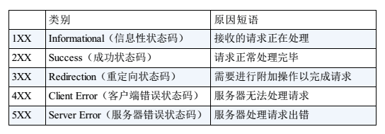  

200:OK 表示从客户端发来的请求在服务器端被正常处理了。   
204:No Content 表示客户端发来的请求处理成功，但是服务端没有资源科返回。一般按在只需要从客户端往服务器发送信息，而对客户端不需要发送新内容的情况下使用。  
206:Partical Content 表示客户端进行了范围请求，而服务器成功执行了这一部分的GET请求。  

301:Moved Permanently 永久性重定向。该状态码表示请求的资源已被分配了新的URI，以后应使用资源现在所指的URI。  
302:Found 临时性重定向。表示请求的资源已被分配了新的URI，希望用户（本次）能使用新的URI访问。  
303:See Other 表示由于请求对应的资源存折另一个URI，应使用GET方法定向获取请求的资源。  
304:Not Modified 表示客户端发送附带条件的请求时，服务器端允许请求访问资源，但为满足条件的情况。  
307:Temporary Redirect 临时性重定向，和302一样。只是它会遵守标准，不会从POST变成GET。  

400:Bed Request 表示请求报文中存在语法错误。当错误发生时，需修改请求的内容后再次发送请求。  
401:Unauthorized 表示发送的请求需要通过HTTP认证的认证信息。另外若之前已进行过一次请求，则表示用户认证失败。浏览器初次接收到401响应，会弹出认证用的对话窗口。  
403:Forbidden 表情对请求资源的访问被服务器拒绝了。  
404:Not Found 表明服务器上无法找到请求的资源。  

500:Internal Server Error 表明服务器端在执行请求时发生了错误。也有可能是web应用存在的BUG或某些临时的故障。  
503:Service Unavailable 表明服务器暂时处于超负载或正在进行停机维护，现在无法处理请求。

### HTTP首部字段一览  
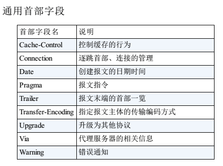  
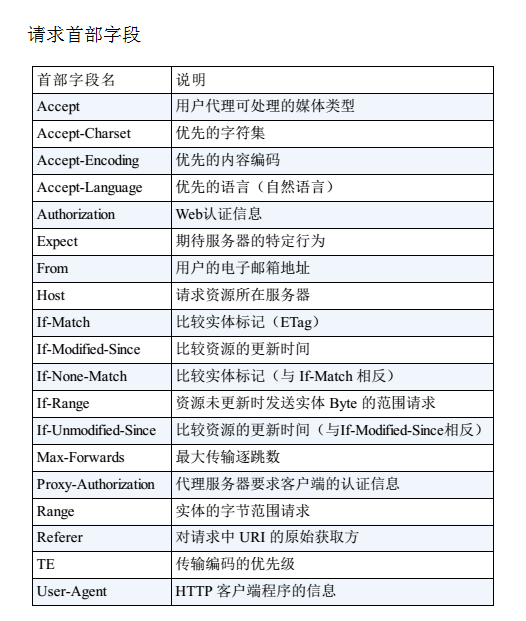  
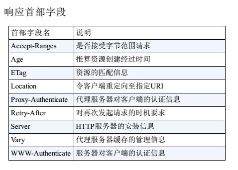  
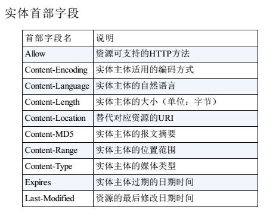  

### HTTPS  

* HTTP的缺点：  
  * 通信使用明文（不加密），内容可能会被窃听  
  * 不验证通信方的身份，因此有可能遭遇伪装
  * 无法证明报文的额完整性，所以有可能已遭篡改

HTTPS（全称：Hyper Text Transfer Protocol over Secure Socket Layer 超文本传输安全协议），是以安全为目标的HTTP通道，简单讲是HTTP的安全版。即HTTP下加入SSL层（Secure Socket Layer，安全嵌套层）或 TSL（Transport Layer Security，安全层传输协议）的组合使用，HTTPS的安全基础是SSL，因此加密的详细内容就需要SSL。

* HTTPS和HTTP的区别
超文本传输协议HTTP协议被用于在Web浏览器和网站服务器之间传递信息。HTTP协议以明文方式发送内容，不提供任何方式的数据加密，如果攻击者截取了Web浏览器和网站服务器之间的传输报文，就可以直接读懂其中的信息，因此HTTP协议不适合传输一些敏感信息，比如信用卡号、密码等。
为了解决HTTP协议的这一缺陷，需要使用另一种协议：安全套接字层超文本传输协议HTTPS。为了数据传输的安全，HTTPS在HTTP的基础上加入了SSL协议，SSL依靠证书来验证服务器的身份，并为浏览器和服务器之间的通信加密。
#### HTTPS和HTTP的区别主要为以下四点：
  * 一、https协议需要到ca申请证书，一般免费证书很少，需要交费。
  * 二、http是超文本传输协议，信息是明文传输，https 则是具有安全性的ssl加密传输协议。
  * 三、http和https使用的是完全不同的连接方式，用的端口也不一样，前者是80，后者是443。
  * 四、http的连接很简单，是无状态的；HTTPS协议是由SSL+HTTP协议构建的可进行加密传输、身份认证的网络协议，比http协议安全。  

  ### HTTPS = HTTP + 加密 + 认证 + 完整性保护

  HTTPS采用混合加密机制
  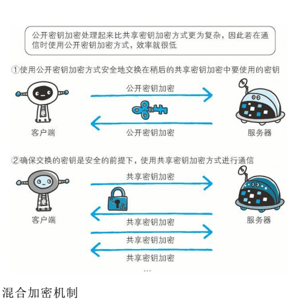  

# WebSocket  
是HTML5开始提供的一种在单个 TCP 连接上进行全双工通讯的协议.  
在WebSocket API中，浏览器和服务器只需要做一个握手的动作，然后，浏览器和服务器之间就形成了一条快速通道。两者之间就直接可以数据互相传送。

浏览器通过 JavaScript 向服务器发出建立 WebSocket 连接的请求，连接建立以后，客户端和服务器端就可以通过 TCP 连接直接交换数据。

当你获取 Web Socket 连接后，你可以通过 send() 方法来向服务器发送数据，并通过 onmessage 事件来接收服务器返回的数据。  

在程序设计中，这种设计叫做回调，即：你有信息了再来通知我，而不是我傻乎乎的每次跑来问你。  
Websocket只需要一次HTTP握手，所以说整个通讯过程是建立在一次连接/状态中，也就避免了HTTP的非状态性，服务端会一直知道你的信息，直到你关闭请求，这样就解决了接线员要反复解析HTTP协议，还要查看identity info的信息。  
同时由客户主动询问，转换为服务器（推送）有信息的时候就发送（当然客户端还是等主动发送信息过来的。。），没有信息的时候就交给接线员（Nginx），不需要占用本身速度就慢的客服（Handler）了   
```  
var Socket = new WebSocket(url, [protocol] );  
```  
以上代码中的第一个参数 url, 指定连接的 URL。第二个参数 protocol 是可选的，指定了可接受的子协议。  
####  WebSocket属性  
* Socket.readyState（只读属性， readyState 表示连接状态）
  * 0 - 表示连接尚未建立。
  * 1 - 表示连接已建立，可以进行通信。
  * 2 - 表示连接正在进行关闭。
  * 3 - 表示连接已经关闭或者连接不能打开。  
* Socket.bufferedAmount（只读属性bufferedAmount 已被 send() 放入正在队列中等待传输，但是还没有发出的 UTF-8 文本字节数。）  

#### WebSocket 事件  
以下是 WebSocket 对象的相关事件。假定我们使用了以上代码创建了 Socket 对象：  
* open  
  * Socket.onopen    连接建立时触发  
* message  
  * Socket.onmessage 客户端接收服务端数据时触发
* error  
  * Socket.onerror   通信发生错误时触发
* close  
  * Socket.onclose   连接关闭时触发  

#### WebSocket 方法  
以下是 WebSocket 对象的相关事件。假定我们使用了以上代码创建了 Socket 对象：  
* Socket.send()  使用连接发送数据  
* Socket.close() 关闭连接  

#### WebSocket 实例  
目前大部分浏览器支持 WebSocket() 接口，你可以在以下浏览器中尝试实例： Chrome, Mozilla, Opera 和 Safari。  
```  
 <script type="text/javascript">
         function WebSocketTest()
         {
            if ("WebSocket" in window)
            {
               alert("您的浏览器支持 WebSocket!");
               
               // 打开一个 web socket
               var ws = new WebSocket("ws://localhost:9998/echo");
                
               ws.onopen = function()
               {
                  // Web Socket 已连接上，使用 send() 方法发送数据
                  ws.send("发送数据");
                  alert("数据发送中...");
               };
                
               ws.onmessage = function (evt) 
               { 
                  var received_msg = evt.data;
                  alert("数据已接收...");
               };
                
               ws.onclose = function()
               { 
                  // 关闭 websocket
                  alert("连接已关闭..."); 
               };
            }
            
            else
            {
               // 浏览器不支持 WebSocket
               alert("您的浏览器不支持 WebSocket!");
            }
         }
  </script> 
```  
##### 安装pywebsocket  
在执行以上程序前，我们需要创建一个支持 WebSocket 的服务。从 pywebsocket 下载 mod_pywebsocket ,或者使用 git 命令下载：  
```  
git clone https://github.com/google/pywebsocket.git  
```  
mod_pywebsocket 需要 python 环境支持

mod_pywebsocket 是一个 Apache HTTP 的 Web Socket扩展，安装步骤如下：  
* 解压下载的文件。  
* 进入pywebsocket目录。  
* 执行命令：  
```  
$ python setup.py build
$ sudo python setup.py install  
```   
* 查看文档说明：  
```  
$ pydoc mod_pywebsocket  
```  
#### 开启服务  
在 pywebsocket/mod_pywebsocket 目录下执行以下命令：  
```  
$ sudo python standalone.py -p 9998 -w ../example/  
```  
以上命令会开启一个端口号为 9998 的服务，使用 -w 来设置处理程序 echo_wsh.py 所在的目录。

现在我们可以在 Chrome 浏览器打开前面创建的 runoob_websocket.html 文件。如果你的浏览器支持 WebSocket(), 点击"运行 WebSocket"，你就可以看到整个流程各个步骤弹出的窗口


