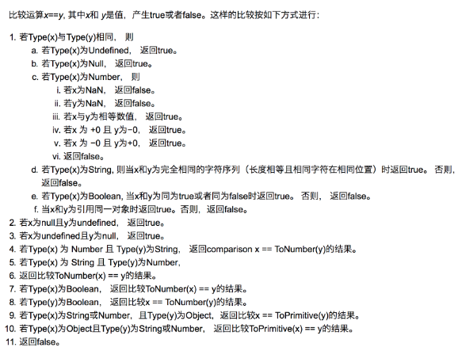

# 一、JavaScript  
## 七种内置类型
* 基本类型  
  * null  
  * undefined  
  * boolean
  * number  
  * string  
  * symbol  
* 对象(Object)
注意：null是基本类型，但是typeof null会显示object 
<!--more--> 
## 类型转换  
### 对象转基本类型  
对象在转换基本类型时，首先会调用 valueOf 然后调用 toString。并且这两个方法你是可以重写的。  
### 操作符  
  
### new  
* 新生成了一个对象
* 链接到原型
* 绑定 this
* 返回新对象  

对于创建一个对象来说，更推荐使用字面量的方式创建对象（无论性能上还是可读性）。因为你使用 new Object() 的方式创建对象需要通过作用域链一层层找到 Object，但是你使用字面量的方式就没这个问题。  

对于 new 来说，还需要注意下运算符优先级。  

        function Foo() {
            return this;
        }
        Foo.getName = function () {
            console.log('1');
        };
        Foo.prototype.getName = function () {
            console.log('2');
        };

        new Foo.getName();   // -> 1
        new Foo().getName(); // -> 2   

new Foo()的优先级大于 new Foo，所以对于上述代码来说可以这样划分执行顺序  

        new (Foo.getName());   
        (new Foo()).getName();

对于第一个函数来说，先执行了 Foo.getName() ，所以结果为 1；对于后者来说，先执行 new Foo() 产生了一个实例，然后通过原型链找到了 Foo 上的 getName 函数，所以结果为 2。  
## 闭包  
闭包的定义很简单：函数 A 返回了一个函数 B，并且函数 B 中使用了函数 A 的变量，函数 B 就被称为闭包。
## 深浅拷贝
        let a = {
            age: 1
        }
        let b = a
        a.age = 2
        console.log(b.age) // 2  
从上述例子中我们可以发现，如果给一个变量赋值一个对象，那么两者的值会是同一个引用，其中一方改变，另一方也会相应改变。

通常在开发中我们不希望出现这样的问题，我们可以使用浅拷贝来解决这个问题。  

### 浅拷贝  
#### object.assign(target, source1, source2) 方法用于对象的合并，将源对象（ source ）的所有可枚举属性，复制到目标对象（ target ）。如果目标对象与源对象有同名属性，或多个源对象有同名属性，则后面的属性会覆盖前面的属性。 
        let a = {
            age: 1
        }
        let b = Object.assign({}, a)
        a.age = 2
        console.log(b.age) // 1  
#### 我们也可以通过展开运算符（…）来解决  
        let a = {
            age: 1
        }
        let b = {...a}
        a.age = 2
        console.log(b.age) // 1  
### 深拷贝  
如果拷贝的对象里面还包含对象的话，则需要深拷贝来解决。  
#### 可以通过 JSON.parse(JSON.stringify(object)) 来解决。        
        let a = {
            age: 1,
            jobs: {
                first: 'FE'
            }
        }
        let b = JSON.parse(JSON.stringify(a))
        a.jobs.first = 'native'
        console.log(b.jobs.first) // FE  
#### 如果你所需拷贝的对象含有内置类型并且不包含函数，可以使用 MessageChannel。（具体搜索实例）  

## 模块化   
ES6 的模块化(在有 Babel 的情况下使用)。  

CommonJs 是 Node 独有的规范，浏览器中使用就需要用到 Browserify 解析了。  

AMD 是由 RequireJS 提出的 
#### 对于 CommonJS 和 ES6 中的模块化的两者区别是：

* 前者支持动态导入，也就是 require(${path}/xx.js)，后者目前不支持，但是已有提案

* 前者是同步导入，因为用于服务端，文件都在本地，同步导入即使卡住主线程影响也不大。而后者是异步导入，因为用于浏览器，需要下载文件，如果也采用导入会对渲染有很大影响

* 前者在导出时都是值拷贝，就算导出的值变了，导入的值也不会改变，所以如果想更新值，必须重新导入一次。但是后者采用实时绑定的方式，导入导出的值都指向同一个内存地址，所以导入值会跟随导出值变化

* 后者会编译成 require/exports 来执行的  

#### AMD 语法  
requireJS定义了一个函数 define，它是全局变量，用来定义模块

define(id?, dependencies?, factory);
1. id：可选参数，用来定义模块的标识，如果没有提供该参数，脚本文件名（去掉拓展名）
2. dependencies：是一个当前模块依赖的模块名称数组
3. factory：工厂方法，模块初始化要执行的函数或对象。如果为函数，它应该只被执行一次。如果是对象，此对象应该为模块的输出值  

        // AMD
        define(['./a', './b'], function(a, b) {
            a.do()
            b.do()
        })
        define(function(require, exports, module) {   
            var a = require('./a')  
            a.doSomething()   
            var b = require('./b')
            b.doSomething()
        })  

## 防抖  
#### 将多次执行变为最后一次执行  
>指频繁触发的情况下，只有足够的空闲时间，才执行代码一次。比如生活中的坐公交，就是一定时间内，如果有人陆续刷卡上车，司机就不会开车。只有别人没刷卡了，司机才开车。 
* 对于按钮防点击来说的实现：一旦我开始一个定时器，只要我定时器还在，不管你怎么点击都不会执行回调函数。一旦定时器结束并设置为 null，就可以再次点击了。
* 对于延时执行函数来说的实现：每次调用防抖动函数都会判断本次调用和之前的时间间隔，如果小于需要的时间间隔，就会重新创建一个定时器，并且定时器的延时为设定时间减去之前的时间间隔。一旦时间到了，就会执行相应的回调函数。  

## 节流  
#### 将多次执行变成每隔一段时间执行。  
>指一定时间内js方法只跑一次。比如人的眨眼睛，就是一定时间内眨一次。这是函数节流最形象的解释。  

## 继承 （详情见ES6阮一峰 class用法、继承）  
## call,apply,bind区别  
`call` 和 `apply` 都是为了解决改变 this 的指向。作用都是相同的，只是传参的方式不同。  
除了第一个参数外，call 可以接收一个参数列表，apply 只接受一个参数数组。

        let a = {
            value: 1
        }
        function getValue(name, age) {
            console.log(name)
            console.log(age)
            console.log(this.value)
        }
        getValue.call(a, 'yck', '24')
        getValue.apply(a, ['yck', '24'])  

`bind `和其他两个方法作用也是一致的，只是该方法会返回一个函数。并且我们可以通过 bind 实现柯里化。  
`柯里化`是指将使用多个参数的函数转换成一系列使用一个参数的函数的技术。

## Promise 实现 （详情见ES6阮一峰） 
可以把 Promise 看成一个状态机。初始是 `pending` 状态，可以通过函数 `resolve` 和 `reject` ，将状态转变为 resolved(已定型) 或者 rejected(已失败) 状态，状态一旦改变就不能再次变化。  
`then` 函数会返回一个 Promise 实例，并且该返回值是一个新的实例而不是之前的实例。  

## Generator 实现 (详情见另一篇博客《Generator知识点杂烩》)  
## Map、FlapMap 和 Reduce
`Map` 作用是生成一个新数组，遍历原数组，将每个元素拿出来做一些变换然后 `append` 到新的数组中。

        [1,2,3].map((item)=> item + 1)
        // -> [2,3,4]  

`FlapMap` 和 `map` 的作用几乎是相同的，但是对于多维数组来说，会将原数组降维。可以将 `FlapMap` 看成是 `map + flatten` ，目前该函数在浏览器中还不支持。  

        [1, [2], 3].flatMap((v) => v + 1)
        // -> [2, 3, 4]

`Reduce` 作用是数组中的值组合起来，最终得到一个值  
语法：`array.reduce(function(total, currentValue, currentIndex, arr), initialValue)`  
* total         必需。初始值, 或者计算结束后的返回值。  
* currentValue  必需。当前元素
* currentIndex  可选。当前元素的索引
* arr           可选。当前元素所属的数组对象。  
* initialValue  可选。传递给函数的初始值  

如果想将一个多维数组彻底的降维，可以这样实现:  

        const flattenDeep = (arr) => Array.isArray(arr)
        ? arr.reduce( (a, b) => [...flattenDeep(a), ...flattenDeep(b)] , [])
        : [arr]

        flattenDeep([1, [[2], [3, [4]], 5]])  

