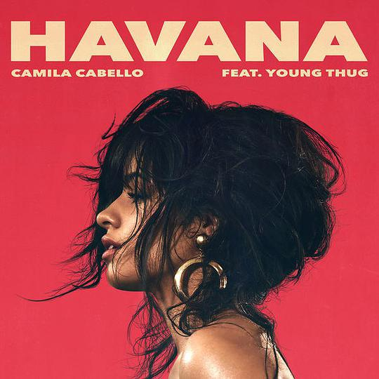

Oh, oh, oh, yeah
噢~噢~噢~耶~
Havana, ooh na-na
哈瓦那~哦啦啦
Half of my heart is in Havana, na-na-na
我的一半心思留在了哈瓦那
He took me back to East Atlanta, na-na-na
他带我重回东亚特兰大
All of my heart is in Havana
如今我的心全都属于哈瓦那
There's somethin' 'bout his manners
犹记得他的一举一动
<!--more--> 
He didn't walk up with that "how you doin'?"
他并没有过来找我搭讪
He said there's a lot of girls I can do with
他说他能驾驭的女孩有很多
I knew him forever in a minute
但我却对他一见钟情
And papa says he got evil in him
尽管爸爸也说他不是个好东西
He got me feelin' like...
他让我小鹿乱撞
Oooh-oooh-ooh, I knew it when I met him
噢噢噢~我对他一见钟情
I loved him when I left him
分别时就已经爱上了他
Got me feelin' like...
他让我脸红心跳
Oooh-oooh-ooh, and then I had to tell him
噢噢噢~但我不得不告诉他：
I had to go, oh na-na-na-na-na
我不得不走了
Havana, ooh na-na
再见了，哈瓦那！
Half of my heart is in Havana, na-na-na
我的一半心思留在了哈瓦那
He took me back to East Atlanta, na-na-na
他带我重回东亚特兰大
All of my heart is in Havana
如今我的心全都属于哈瓦那
There's somethin' 'bout his manners
犹记得他的一举一动
Oooh-oooh-ooh, Oooh-oooh-ooh, Oooh-oooh-ooh
哦~哦~哦~
Oh-na-na-na
哦啦啦啦
Havana, ooh na-na
哈瓦那~哦啦啦
Half of my heart is in Havana, na-na-na
我的一半心思留在了哈瓦那
He took me back to East Atlanta, na-na-na
他带我重回东亚特兰大
All of my heart is in Havana
如今我的心全都属于哈瓦那
There's somethin' 'bout his manners
犹记得他的一举一动
Ooh na-na, Ooh na-na
哦啦啦~哦啦啦
Oooh-oooh-ooh,
哦~哦~哦~
Havana, ooh na-na
哈瓦那~哦啦啦~
Yeah yeah yeah, Havana, ooh na-na
耶耶耶，哈瓦那哦啦啦~