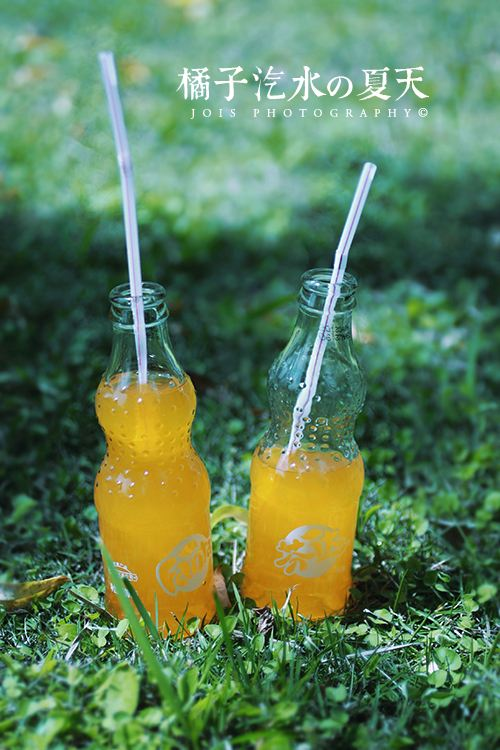

词与唱：大包子，Jony J

好沮丧 the Summer’s Gone 气温又降了 不知不觉又添了衣裳
仲夏一个单薄的梦 像是纱做的蚊帐 被折叠成秘密封藏
Oh no the Summer’s Gone , my life becomes from fresh to dark brown 
想起那时的夜短昼长 热浪 似乎将我的青春期延长

等待一场半夜的球赛 左手啤酒右手可乐都加满了冰块
冰激凌听话的躺在冷柜 等着触碰我们干燥的唇和胃 
大口的喝水 一杯又一杯 每当汗流浃背 虚弱又颓废
细胞，嗷嗷待哺的张开了嘴 补充了能量继续PLAY DA GAME
男孩迫不及待的跳进池塘 假装乘风破浪 水花肆意碰撞
水鬼也被逼上了岸 仿佛生的热气驱走了死的严寒
天亮得早白天长 不用闹钟我也不会赖床 
冲凉 柠檬沐浴香
裸露的皮肤 汗毛茁壮生长 
花露水的味道是种安心的清凉
蚊虫的叮咬 挠了又挠的瘙痒
泄气的大地 苦等着风 稠腻的晌午 人们寻找遮蔽行色匆匆
躲在屋里 不用找别的借口 
你是我的解暑良药我的冰镇樱桃汽酒
咽下一口 沿着我的食道四壁
湿润粗糙的黏膜 沁入我的心脾
<!--more-->

说真的时间他就是个小气鬼 
在半睡半醒之间多想让闹钟闭嘴 
这种感觉可以去跟fly high媲美 
我伸手就抓过了桌上的汽水
在湿热的午后 好像被下了诅咒 
我甚至可以闻到自己灵魂里的腐臭 
这好热 我实在爱死这个季节 
暴烈的阳光赤裸的晒出这个世界 
连呼吸都烫口 千万别把冷气放走 
它塞满整个房间走廊散在每个窗口 
我打开冰箱 有西瓜和饮料 
就听着jazz打2k 我欢迎你来领教 
听窗外有鸟叫 蝉鸣 和小孩哭闹 
乘凉下棋的老人这一局又是谁输掉 
b boys b girls还在街上跳舞
而夏天的结束也慢慢进入倒数

我才顾不得这天气的炎热 
拥着你亲吻你汗湿的颈脖
你眼神的闪烁好像星空的斑驳 
你跳跃的脊背是我心跳的忐忑
这热度加速挥发你的香气 
凉席 留着你形状的汗滴
你毛孔微张 浅浅深深的呼吸 
吱呀的电扇回应着我们的轻声密语
不停息的蝉鸣 跃跃欲试的情绪
而我一直心急 害怕片刻的分离
I wish my summer could last forever 
get sweaty already we ran wild n wilder

整个夏日我一直在挥霍 发烫的眼神点燃荷尔蒙和不安的动作
阳光刺眼的片刻 美丽就快饱和 
你给的快乐是我深陷的沼泽
但如果你走了 我的夏天就变晦涩
我收集六七八月却永远等不来收获
或许一夜长大是我唯一的选择
但我还妄想 守望夏天的那个我会复活
But the summer’s gone 
My songs are not done
The wind blowing will never tell me where did I go wrong